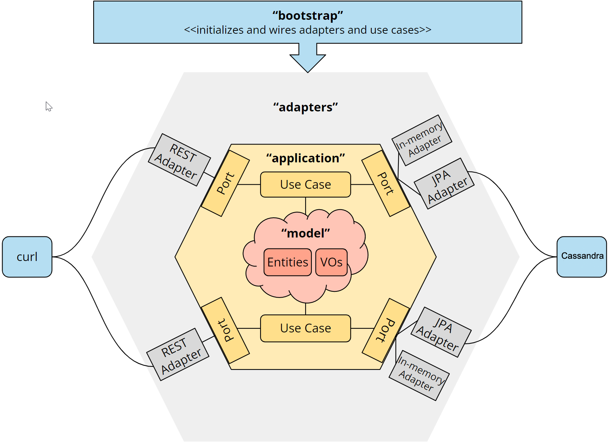

# Hexagonal Architecture in Java Tutorial

This repository contains a sample Java REST application implemented according to hexagonal architecture.

It is part of the HappyCoders tutorial series on Hexagonal Architecture:
* [Part 1: Hexagonal Architecture - What Is It? Why Should You Use It?](https://www.happycoders.eu/software-craftsmanship/hexagonal-architecture/).
* [Part 2: Hexagonal Architecture with Java - Tutorial](https://www.happycoders.eu/software-craftsmanship/hexagonal-architecture-java/).
* [Part 3: Ports and Adapters Java Tutorial: Adding a Database Adapter](https://www.happycoders.eu/software-craftsmanship/ports-and-adapters-java-tutorial-db/).
* [Part 4: Hexagonal Architecture with Quarkus - Tutorial](https://www.happycoders.eu/software-craftsmanship/hexagonal-architecture-quarkus/).
* [Part 5: Hexagonal Architecture with Spring Boot - Tutorial](https://www.happycoders.eu/software-craftsmanship/hexagonal-architecture-spring-boot/).

# Architecture Overview

The source code is separated into four modules:
* `domain` - contains the domain model
* `application` - contains the domain services and the ports of the hexagon
* `adapters` - contains the REST, in-memory and JPA adapters
* `boostrap` - contains the configuration and bootstrapping logic

The following diagram shows the hexagonal architecture of the application along with the source code modules:

